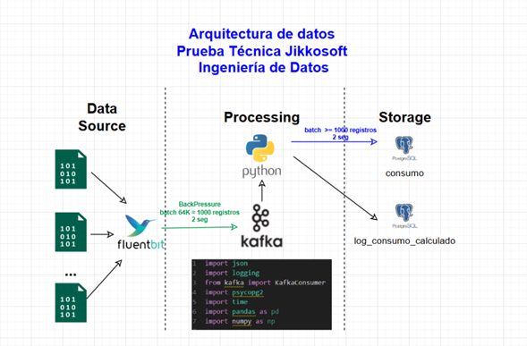
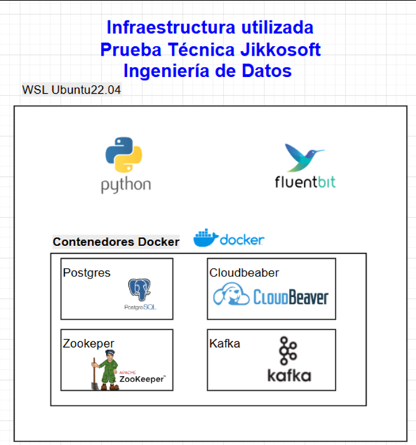

# 📤🗂️📥 PRUEBA TÉCNICA JIKKOSOFT - DATA ENGINEER 📤🗂️📥


Data Engineer project for a pipeline that take data files and using Microbatching loading in a Postgres Database

## 🗂️ Data Architecture



## 🗂️ Infraesctructure used



## 🗂️ Project Organization

```
├── DB.sql						  <- Script with the tables in the postgres database created.
├── README.md					  <- The top-level README for developers using this project.
├── batch_control.lua		<- Lua script, which uses Fluentbit for processing towards Kafka
├── data 						    <- Folder with the set of data files
│   ├── dataset-1.txt
│   ├── dataset-2.txt
│   ├── dataset-3.txt
│   ├── dataset-4.txt
│   ├── dataset-5.txt
│   ├── maximos (1).csv
│   ├── minimos (1).csv
│   └── tarifa_por_destino (1).csv
│
│
├── docker-compose.yml	<- Contains the Docker infrastructure to deploy the solution
├── fluent-bit.conf			<- File that configures the pipeline from text files to Kafka
├── gitignore.txt 				
├── log							    <- folder that contains the sqlite file, with information of 
│   │                      file procesed by fluentbit
│   │
│   └── flb_dataet.db
├── parser.conf 				<- Contains the pattern of the data that have to read fluentbit
└── python              <- Project that manage from Kafka to the database storage    
    ├── app.log					<- Logs with development issues to monitor the pipeline
    ├── calculate.py 		<- Calculate every row taken from kafka and calculate with pandas
    ├── processor.py 		<- Manage the process from consume kafka until storage in the database
    └── requirements.txt<- The requirements file for reproducing the analysis environment, e.g.
│                          generated with `pip freeze > requirements.txt`

```

## 🔖 Commit Conventions

Este es una convención que utiliza prefijos específicos en los mensajes de commit para indicar el tipo de cambio que se realizó en el código.

**Recomendaciones:**

* Usar el mismo idioma dentro del mismo repositorio para mayor coherencia y claridad, se recomienda inglés por universalidad.

* Escribir los commits iniciando con verbos en presente simple, es decir, crear, actualizar, administrar o *create, update, manage* en inglés.

* Cuando se va a realizar un cambio que podría ser muy grande o "rompedor", usar el formato **BREAKING CHANGE** en el que si se va a realizar un gran cambio, se deja un ! luego del prefijo y el alcance/contexto, ejemplo:  	```
fix(lambda)!: Change of the orchestration to step functions.	```

<table>
  <tr>
    <th colspan="4" align="center">🚀CONVENTIONAL COMMIT🚀</th>
  </tr>
  
  <tr>
    <th align="center"><strong>Tipo (prefijo)</strong></th>
    <th align="center"><strong>Contexto</strong></th>
    <th align="center"><strong>Descripción</strong></th>
    <th align="center"><strong>Ejemplo</strong></th>
  </tr>
  <tr>
    <td align="center">feat</td>
    <td align="center">classes</td>
    <td>Añadir clase para limpieza de datos</td>
    <td><code>feat (classes): Add functions to clean data</code></td>
  </tr>
  <tr>
    <td align="center">fix</td>
    <td align="center">data</td>
    <td>Corregir repositorio de datos actualizado</td>
    <td><code>fix (data): Fix the clients data repository</code></td>
  </tr>
  <tr>
    <td align="center">docs</td>
    <td align="center">docs</td>
    <td>Crear la documentación inicial del proyecto</td>
    <td><code>docs (docs): Create README.md file of the project</code></td>
  </tr>
  <tr>
    <td align="center">chore</td>
    <td align="center">Models</td>
    <td>Adicionar nueva variable “edad” al modelo</td>
    <td><code>chore (models): Add new variable age, to the model</code></td>
  </tr>
  <tr>
    <td align="center">test</td>
    <td align="center">notebooks</td>
    <td>Pruebas sobre el resultado del notebook generado</td>
    <td><code>test (notebooks): Create unit test of a notebook component</code></td>
  </tr>
  <tr>
    <td colspan="4"  align="center"><strong>Source:</strong> <a href="https://www.conventionalcommits.org/en/v1.0.0/">https://www.conventionalcommits.org/en/v1.0.0/</a></td>    
  </tr>
  <tr>    
    <td colspan="4" align="center"><strong>Created by:</strong> Yarly Madrid</td>
  </tr>
</table>


## 💻 Tech Stack

**Programming Language:** Python 🐍

**Principal Libraries Used** 

Package         Version
--------------- -----------
kafka-python    2.0.2
numpy           2.2.4
pandas          2.2.3
pip             22.0.2
psycopg2-binary 2.9.6
python-dateutil 2.9.0.post0
pytz            2025.2
setuptools      59.6.0
six             1.17.0
tzdata          2025.2


* kafka-python==2.0.2
* numpy==2.2.4
* pandas==2.2.3
* psycopg2-binary==2.9.6
* pytz==2025.2
* six==1.17.0
* tzdata==2025.2


For more details go to *requirements.txt*.

## 🚀 Run Locally

Clone the project

```bash
  git clone https://github.com/danielinsuasti/DataEngineerJikkosoft_Test
```

Go to the project directory

```bash
  cd python
```
Activate the environment
```bash
  source .venv_KafkaFluentbitPostgres/bin/activate
```
Install python libraries in the virtual enviroment

```bash
  pip install -r .\requirements.txt
```


--------

